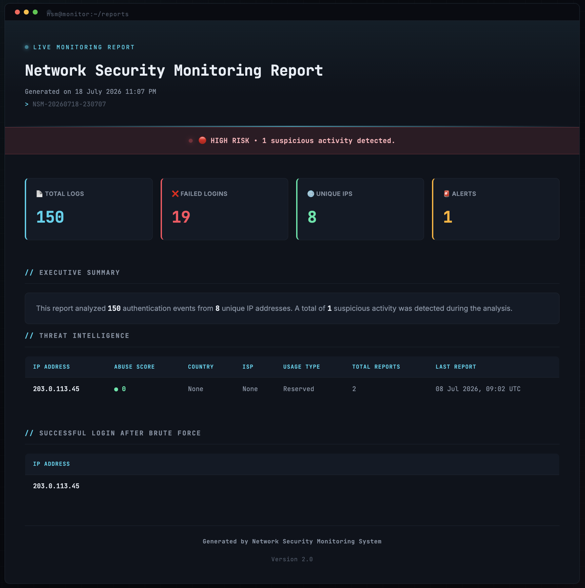

# 🛡️ Network Security Monitoring System


A Python-based **Network Security Monitoring System** that analyzes authentication logs, detects suspicious authentication activity, enriches suspicious IPs using AbuseIPDB, and generates interactive HTML security reports.

<p align="center">
  
</p>

## Table of Contents

- [Why This Project](#why-this-project)
- [Key Capabilities](#key-capabilities)
- [System Architecture](#system-architecture)
- [Project Structure](#project-structure)
- [Getting Started](#getting-started)
- [Configuration](#configuration)
- [Running the Application](#running-the-application)
- [Tech Stack](#tech-stack)
- [Learning Outcomes](#learning-outcomes)
- [Author](#author)

## Why This Project?

Authentication logs contain valuable security information, but manually analyzing hundreds of log entries to identify suspicious activity is both time-consuming and error-prone. Security analysts need tools that can quickly identify potential threats, summarize security events, and present findings in a clear and actionable format.

This project was built to simulate a simplified Security Operations Center (SOC) workflow by automating log analysis, detecting brute-force attacks, enriching suspicious IP addresses with threat intelligence from AbuseIPDB, and generating an interactive HTML security report for investigation.


##  Key Capabilities

###  Authentication Log Analysis
Parses authentication logs and extracts key security metrics, including total events, failed login attempts, and unique IP addresses to provide a clear overview of system activity.

###  Brute-Force Attack Detection
Identifies IP addresses that exceed configurable failed login thresholds, helping detect potential brute-force attacks before they succeed.

###  Threat Intelligence Integration
Enriches suspicious IP addresses with real-time reputation data from **AbuseIPDB**, including abuse confidence score, ISP, country, usage type, and historical abuse reports.

###  Successful Login After Brute Force Detection
Detects authentication attempts where an attacker successfully logs in after multiple failed attempts, highlighting high-risk security events that require immediate attention.

###  HTML Security Reporting
Generates a professional HTML security report featuring an executive summary, security metrics, threat intelligence, detection results, and a clean dashboard-style interface.

###  Configurable Detection Engine
Supports configurable detection thresholds through a JSON configuration file, allowing security rules to be adjusted without modifying the source code.

###  Robust Error Handling
Handles missing files, malformed log entries, invalid configuration files, network failures, and API errors gracefully to ensure reliable execution.


## System Architecture

The application follows a modular pipeline where each component performs a single responsibility. Authentication logs move through multiple processing stages before being transformed into a structured HTML security report.

```text
                    Authentication Logs
                            │
                            ▼
                     ┌─────────────┐
                     │   Parser    │
                     └──────┬──────┘
                            │
                            ▼
                     ┌─────────────┐
                     │  Analyzer   │
                     └──────┬──────┘
                            │
             ┌──────────────┴──────────────┐
             ▼                             ▼
      ┌─────────────┐              ┌─────────────────┐
      │  Detector   │              │ Threat Intel    │
      └──────┬──────┘              └────────┬────────┘
             └──────────────┬───────────────┘
                            ▼
                  ┌────────────────────┐
                  │ Report Generator   │
                  └─────────┬──────────┘
                            ▼
             Interactive HTML Security Report
```

### Pipeline

1. **Parser** reads raw authentication logs and converts each entry into structured data.
2. **Analyzer** calculates security statistics such as failed logins, total events, and unique IP addresses.
3. **Detector** identifies suspicious activity using configurable detection rules.
4. **Threat Intelligence** enriches suspicious IP addresses using AbuseIPDB.
5. **Report Generator** combines all collected information into a structured HTML security report.


## Project Structure

```text
network-security-monitoring-system/
│
├── data/
│   └── sample_log.txt
│
├── reports/
│   └── security_report.html
│
├── screenshots/
│
├── src/
│   ├── analyzer.py
│   ├── detector.py
│   ├── main.py
│   ├── parser.py
│   ├── report_generator.py
│   └── threat_intelligence.py
│
├── templates/
│   └── report_template.html
│
├── config.json
├── .env.example
├── requirements.txt
├── README.md
└── .gitignore
```

### Directory Overview

| Directory / File | Purpose |
|------------------|---------|
| `src/` | Contains the core application modules responsible for parsing logs, analyzing security events, detecting suspicious activity, enriching IPs with threat intelligence, and generating HTML reports. |
| `data/` | Stores sample authentication logs used for analysis. |
| `templates/` | Contains the HTML template used to generate security reports. |
| `reports/` | Stores generated HTML security reports. |
| `screenshots/` | Contains images used in the project documentation. |
| `config.json` | Stores configurable application settings such as detection thresholds. |
| `.env.example` | Template for configuring the AbuseIPDB API key. |


## Getting Started

### Prerequisites

Before running the project, ensure you have:

- Python 3.10 or later
- Git
- An AbuseIPDB API key

---

### Clone the Repository

```bash
git clone https://github.com/Sunkencoder19/network-security-monitoring-system.git
cd network-security-monitoring-system
```

---

### Create a Virtual Environment

**macOS / Linux**

```bash
python3 -m venv .venv
source .venv/bin/activate
```

**Windows**

```bash
python -m venv .venv
.venv\Scripts\activate
```

---

### Install Dependencies

```bash
pip install -r requirements.txt
```

## Configuration

The application uses two configuration files:

### `.env`

Create a `.env` file in the project root and add your AbuseIPDB API key:

```env
ABUSEIPDB_API_KEY=your_api_key_here
```

You can obtain a free API key by creating an account at AbuseIPDB.

---

### `config.json`

Detection rules can be customized without modifying the source code.

Example:

```json
{
    "failed_login_threshold": 5
}
```

## Running the Application

Execute the application using:

```bash
python src/main.py
```

After execution, the application will:

1. Parse authentication logs.
2. Analyze security events.
3. Detect suspicious activity.
4. Retrieve threat intelligence for suspicious IP addresses.
5. Generate an interactive HTML security report.

The generated report is saved in:

```text
reports/security_report.html
```

## Tech Stack

- Python 3
- Requests
- HTML5
- CSS3
- AbuseIPDB API
- Git
- GitHub

## Learning Outcomes

This project strengthened my understanding of:

- Log parsing and structured data processing
- Detection of suspicious authentication activity
- Threat intelligence integration using external APIs
- Modular software architecture
- HTML report generation
- Secure handling of environment variables and API keys

## Author

**Fattesing Rane**

Computer Engineering Student

Interested in Cybersecurity, Network Security, and Software Engineering.

- GitHub: https://github.com/Sunkencoder19